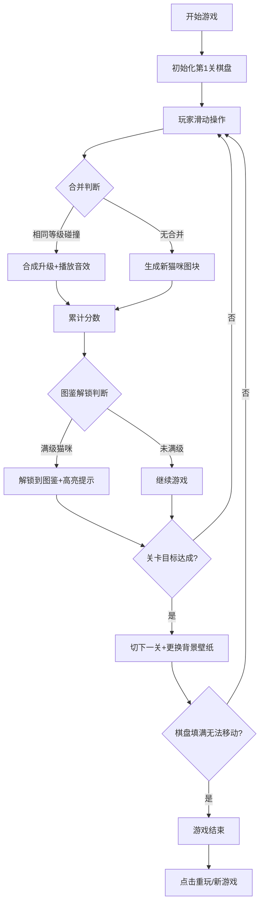

## 1. 产品概述

猫咪合成是一款基于2048滑动合并玩法的休闲益智小游戏，玩家通过滑动棋盘合并相同等级的猫咪图块来升级，最终收集所有猫咪图鉴。

- 目标用户：喜欢休闲益智、收集养成类游戏的玩家
- 产品价值：轻松治愈的合成玩法 + 猫咪收集乐趣，配合像素风复古美学

## 2. 核心功能

### 2.1 功能模块
1. **游戏主界面**：中央棋盘（4x4网格）、右侧图鉴栏、底部关卡进度条
2. **核心玩法**：滑动合并、猫咪升级、分数累计
3. **关卡系统**：目标分数达成自动切关、每关更换背景壁纸
4. **图鉴系统**：满级猫咪自动解锁到图鉴、展示已收集猫咪
5. **音效系统**：BGM背景音乐、合成叮咚音效
6. **控制按钮**：像素风新游戏/重玩/暂停按钮

### 2.2 页面详情

| 页面名称 | 模块名称 | 功能描述 |
|-----------|-------------|---------------------|
| 游戏主页面 | 棋盘区 | 4x4网格，支持键盘方向键和鼠标滑动操作 |
| 游戏主页面 | 图鉴栏 | 右侧垂直滚动面板，展示已解锁和未解锁的猫咪卡片 |
| 游戏主页面 | 关卡进度 | 底部进度条显示当前分数/目标分数，达成自动切关 |
| 游戏主页面 | 控制按钮 | 新游戏、暂停、音效开关，像素风按钮样式 |
| 游戏主页面 | 信息展示 | 当前关卡、当前分数、最高分数 |

## 3. 核心流程

## 4. 用户界面设计

### 4.1 设计风格

- **主色调**：温暖奶油米色 `#FFF8E7` 为背景基底，像素粉 `#FF9AA2`、像素橙 `#FFB347`、像素绿 `#77DD77` 为猫咪等级色彩
- **辅助色**：像素紫 `#B19CD9`、像素蓝 `#87CEEB` 用于按钮和UI强调
- **按钮风格**：8-bit 像素风立体按钮，带凸起边框阴影，点击有下沉效果
- **字体**：像素字体 Press Start 2P 或 VT323，营造复古游戏感
- **布局风格**：三栏式布局，左/中为棋盘（大区域），右侧为图鉴栏，底部通栏进度条
- **视觉元素**：猫咪使用 emoji + 彩色渐变方块组合，每级对应不同颜色和猫咪emoji

### 4.2 页面设计概览

| 页面名称 | 模块名称 | UI元素 |
|-----------|-------------|-------------|
| 主页面 | 棋盘区 | 4x4像素格，每格带圆角和深色描边，猫咪图块带pop弹出动画 |
| 主页面 | 图鉴栏 | 卡片网格2列，未解锁灰色锁定，已解锁彩色显示，新解锁有光芒动画 |
| 主页面 | 进度条 | 像素风格分段进度条，填满时闪烁过渡动画 |
| 主页面 | 控制区 | 像素按钮：NEW GAME / PAUSE / SOUND，带hover和active状态 |

### 4.3 响应式

- 桌面端优先：三栏布局（棋盘居中，图鉴在右）
- 平板端：图鉴折叠为底部面板
- 移动端：单列布局，图鉴可切换显示，支持触摸滑动操作

### 4.4 动画设计

- 图块生成：从中心scale(0)弹出scale(1)的弹性动画
- 合并效果：合并瞬间scale(1.2)闪烁后恢复
- 图鉴解锁：金光发散动画 + 轻微抖动
- 关卡切换：背景渐变过渡 + 像素星星撒落特效
- 按钮交互：hover上浮2px + 阴影加深，active下沉2px
