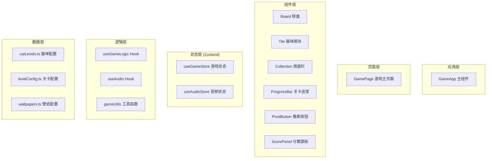

## 1. 架构设计



## 2. 技术说明

- 前端框架：React@18 + TypeScript
- 构建工具：Vite@5
- 样式方案：TailwindCSS@3 + 自定义CSS像素风样式
- 状态管理：Zustand
- 音频方案：Web Audio API（程序化合成BGM和音效，无需外部资源）
- 图标：lucide-react

## 3. 路由定义

| 路由 | 用途 |
|-------|---------|
| / | 游戏主页面（单页应用，唯一页面） |

## 4. 数据模型

### 4.1 核心类型定义

```typescript
// 猫咪等级配置
interface CatLevel {
  level: number;          // 1-12级
  name: string;           // 猫咪名字
  emoji: string;          // 猫咪emoji
  color: string;          // 方块背景色
  textColor: string;      // 文字颜色
  scoreValue: number;     // 合并得分
}

// 棋盘图块
interface Tile {
  id: number;
  level: number;
  row: number;
  col: number;
  isNew?: boolean;        // 新生成动画标记
  isMerged?: boolean;     // 合并动画标记
}

// 关卡配置
interface LevelConfig {
  level: number;
  targetScore: number;    // 通关目标分数
  wallpaperIndex: number; // 背景壁纸索引
  title: string;          // 关卡名称
}

// 游戏状态
interface GameState {
  board: (Tile | null)[][];  // 4x4棋盘
  score: number;
  bestScore: number;
  currentLevel: number;      // 当前关卡
  unlockedCats: number[];    // 已解锁猫咪等级
  isGameOver: boolean;
  isPaused: boolean;
  nextTileId: number;
}
```

### 4.2 项目目录结构

```
src/
├── components/
│   ├── Board.tsx           # 4x4棋盘
│   ├── Tile.tsx            # 单个猫咪图块
│   ├── Collection.tsx      # 图鉴面板
│   ├── ProgressBar.tsx     # 关卡进度条
│   ├── PixelButton.tsx     # 像素风按钮
│   ├── ScorePanel.tsx      # 分数面板
│   └── Background.tsx      # 动态壁纸背景
├── hooks/
│   ├── useGameLogic.ts     # 游戏核心逻辑Hook
│   └── useAudio.ts         # 音频合成Hook
├── store/
│   ├── useGameStore.ts     # 游戏状态
│   └── useAudioStore.ts    # 音频开关状态
├── data/
│   ├── catLevels.ts        # 12个等级猫咪配置
│   ├── levelConfig.ts      # 关卡配置（分数/壁纸）
│   └── wallpapers.ts       # 壁纸渐变配置
├── utils/
│   └── gameUtils.ts        # 滑动/合并算法工具
├── pages/
│   └── GamePage.tsx        # 游戏主页面
├── App.tsx
├── main.tsx
└── index.css
```

## 5. 核心算法说明

### 5.1 滑动合并算法（2048标准算法）

1. 根据滑动方向遍历行或列
2. 对每一行/列：
   - 移除所有空值（压缩）
   - 相邻相同等级合并（升级+加分）
   - 再次压缩填充合并后的空位
3. 计算是否发生变化，有变化则生成新图块
4. 判断游戏是否结束（棋盘满且无可合并）

### 5.2 Web Audio API 合成音效

- **BGM**：使用OscillatorNode生成循环8-bit旋律（C大调简单琶音），GainNode控制音量包络
- **合成音效**：快速频率上扫的正弦波 + 指数音量衰减，模拟"叮咚"声
- **解锁音效**：上升音阶琶音
- **过关音效**：胜利旋律序列

### 5.3 图鉴解锁规则

- 当棋盘上合成出满级（等级12）猫咪时，该等级自动加入unlockedCats
- 非满级猫咪在图鉴中显示为未解锁灰色状态
- 新解锁时有光芒动画和解锁音效
